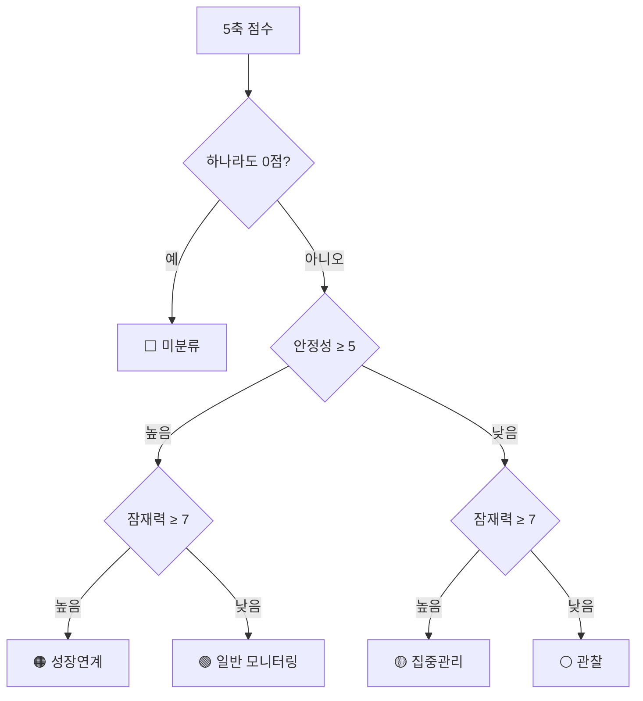

---
tags:
  - 도메인규칙
  - 함께일하는재단
구현: web/src/lib/domain/classify.ts
updated: 2026-07-28
---
> [!danger] 임계값 5·7을 바꾸지 마세요
> 의뢰자가 실무 경험으로 정한 기준입니다. 조정하면 분류 결과가 전부 달라집니다.

# 🎯 5축 진단과 4분류

이 시스템에서 **가장 중요한 규칙**. 참여 기관을 어떻게 사후관리할지 결정합니다.

---

## 5축 점수

각 축은 **0 = 미입력 · 1 = 미흡 · 2 = 보통 · 3 = 우수**

| 축 | 코드 | 어느 쪽 |
|---|---|---|
| 회계·행정 역량 | `accounting` | 🛡 안정성 |
| 자립 가능성 | `sustainability` | 🛡 안정성 |
| 사업수행 역량 | `execution` | 🚀 잠재력 |
| 성과 달성도 | `outcome` | 🚀 잠재력 |
| 재단 연계 관심 | `linkage` | 🚀 잠재력 |

## 계산

```
🛡 안정성 = accounting + sustainability     → 0~6점 · 5점 이상 "높음"
🚀 잠재력 = execution + outcome + linkage   → 0~9점 · 7점 이상 "높음"
```



|  | 🚀 잠재력 **높음** | 🚀 잠재력 **낮음** |
|---|---|---|
| 🛡 안정성 **높음** | 🟠 **성장연계** | 🟢 **일반 모니터링** |
| 🛡 안정성 **낮음** | 🟡 **집중관리** | ⚪ **관찰** |

> [!tip] 수동 지정이 우선
> 관리자가 손으로 분류를 지정하면 자동 판정을 **덮어씁니다.**

---

## 분류별 대응 지침

> [!example]- 🟠 성장연계 — 안정적이고 잠재력 높음
> 재단 타사업 연계, 우수사례·네트워크 허브, 모금 스토리 대상으로 권장.

> [!example]- 🟡 집중관리 — 잠재력 높으나 안정성 낮음
> 멘토·회계사 연계와 분기 점검 등 후속지원을 우선 배정.

> [!example]- 🟢 일반 모니터링 — 안정적이고 추가 욕구 적음
> 반기 1회 안부·콘텐츠 제공 수준으로 관리.

> [!example]- ⚪ 관찰 — 안정성·잠재력 모두 낮음
> 기본 모니터링, 필요 시 역량강화 지원 검토.

---

🔗 [[함께일하는재단 시스템 - 도메인 규칙]] · [[규칙 - 진행 단계와 참여자 상태]] · [[규칙 - 정산]]
