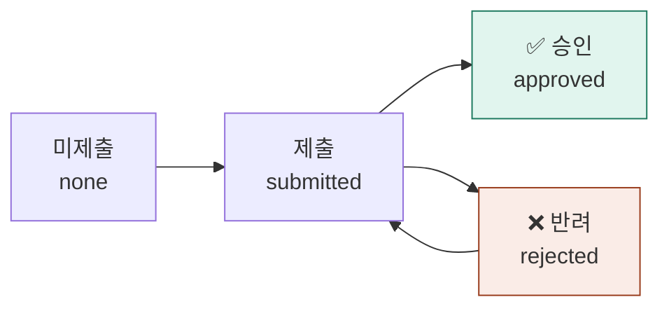

---
tags:
  - 도메인규칙
  - 함께일하는재단
updated: 2026-07-28
---
# 📝 결과보고와 첨부파일

---

## 결과보고 상태

> [!warning] 반려에는 사유가 필수
> 관리자가 반려하면 **사유를 반드시 입력**해야 하고, 참여자 화면에 그 사유가 그대로 보입니다.
> 참여자는 수정 후 재제출할 수 있습니다.

---

## 첨부파일

| 종류 | 언제 |
|---|---|
| 신청 첨부 | 신청서 제출 시 |
| 결과 파일 | 결과보고 제출 시 |
| 공모 대표 이미지 | 관리자가 공모 등록 시 |

> [!failure] 원본의 치명적 결함
> 원본은 파일을 **브라우저 저장소에 통째로** 넣었습니다. 문제가 셋이었습니다.
> 1. 파일당 **3MB 제한**
> 2. 브라우저 전체 용량 한계(5~10MB)를 넘으면 **아무 경고 없이 첨부가 사라짐**
> 3. 다른 기기·다른 브라우저에서는 **파일이 안 보임**
>
> 재구축 시 반드시 서버 저장소로 옮기고, **업로드 실패는 사용자에게 에러로 알려야** 합니다.

---

🔗 [[함께일하는재단 시스템 - 도메인 규칙]] · [[규칙 - 진행 단계와 참여자 상태]]
