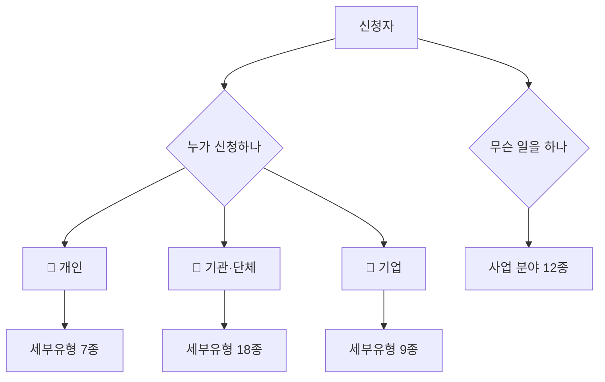

---
tags:
  - 도메인규칙
  - 함께일하는재단
  - 복지분류
구현: web/src/lib/taxonomy.ts
updated: 2026-07-29
---
> [!question] 재단 확인이 필요합니다
> 이 분류는 **일반적인 사회복지 영역 구분을 기준으로 리더가 작성한 것**입니다.
> 재단에서 실제로 쓰는 용어와 다를 수 있으니 의뢰자에게 대조받아야 합니다.
> 🔧 고칠 곳: `web/src/lib/taxonomy.ts` **한 파일만 고치면 전체 화면에 반영됩니다.**

# 🏷 복지 분류 체계

원본 프로토타입은 기관 유형이 7개뿐이라 복지 현장을 담기엔 거칠었습니다. 두 축으로 다시 짰습니다.

---

## 1️⃣ 신청 주체 3종

| 코드 | 표시 | 비고 |
|---|---|---|
| `individual` | 개인 | 원본에도 있던 구분 |
| `org` | 기관·단체 | 원본의 '기관·기업'에서 분리 |
| `company` | 기업 | **신설** — 사회적기업·협동조합은 기관과 성격이 다름 |

---

## 2️⃣ 사업 분야 12종

관리자 화면에서 **"분야별로"** 거를 때 쓰는 기준입니다.

| | | |
|---|---|---|
| 아동·청소년 | 노인 | 장애인 |
| 여성·가족 | 다문화·이주민 | 노숙인·주거취약 |
| 저소득·자활 | 정신건강 | 보건·의료 |
| 일자리·자립 | 지역사회·마을 | 문화·예술 |

---

## 3️⃣ 세부 유형 — 주체에 따라 목록이 달라집니다

> [!example]- 🏢 기관·단체 18종
> 사회복지관 · 지역아동센터 · 노인복지관 · 노인주야간보호센터 · 장애인복지관 · 장애인주간보호시설 · 청소년수련시설 · 아동양육시설·그룹홈 · 지역자활센터 · 정신건강복지센터 · 다문화가족지원센터 · 건강가정지원센터 · 자원봉사센터 · 비영리민간단체 · 사단법인·재단법인 · 사회복지법인 · 마을공동체·주민조직 · 기타 기관·단체

> [!example]- 💼 기업 9종
> 사회적기업 · 예비사회적기업 · 협동조합 · 사회적협동조합 · 마을기업 · 자활기업 · 소셜벤처 · 일반기업 · 기타 기업

> [!example]- 👤 개인 7종
> 현장 활동가 · 사회복지사 · 창작자·예술인 · 연구자 · 자원봉사자 · 프리랜서 · 기타 개인

---

## 4️⃣ 그 외 구분

| 항목 | 값 |
|---|---|
| 연령대 (개인) | 10대 · 20대 · 30대 · 40대 · 50대 · 60대 이상 |
| 규모 (기관·기업) | 연 1억 미만 · 1~5억 · 5~10억 · 10억 이상 |
| 지역 | 시도 17종 (시군구는 프로토타입 단계에서 생략) |

---

## 📌 이 분류가 쓰이는 곳

- 참여자 화면 `/` 상세검색의 **사업구분 · 대상구분** 체크박스
- 관리자 `/applications` 구분·분야 필터
- 관리자 `/members` 구분·분야 필터, 정보 수정 폼
- 보고서 **주체별·분야별 분포**
- CSV 내려받기 열

---

🔗 [[함께일하는재단 시스템 - 도메인 규칙]] · [[함께일하는재단 시스템 - 진행 현황]]
