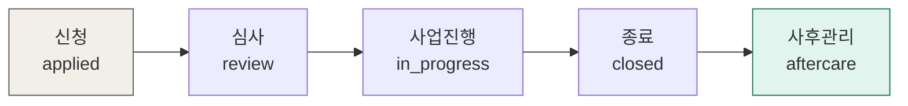

---
tags:
  - 도메인규칙
  - 함께일하는재단
구현: web/src/lib/domain/stage.ts
updated: 2026-07-28
---
> [!important] 이 분리가 원본 설계의 핵심
> 관리자가 보는 **단계**와 참여자에게 보이는 **상태**는 다릅니다.
> 관리자 화면이 '사업진행'이어도 참여자에게는 그냥 '선정'으로 보입니다.

# 🔀 진행 단계와 참여자 상태

---

| 내부 stage | 참여자 status | 참여자 화면 표시 |
|---|---|---|
| `applied` | `received` | 접수 완료 |
| `review` | `reviewing` | 심사 중 |
| `review` (결과 확정) | `selected` / `rejected` | 선정 / 미선정 |
| `in_progress` | `selected` | 사업 수행 중 |
| `closed` | `selected` | 종료 |
| `aftercare` | `selected` | 사후관리 |

---

> [!warning] 잠금 규칙
> 참여자는 **`applied` 단계에서만** 신청서를 수정할 수 있습니다. 심사가 시작되면 잠깁니다.

> [!note] 원본에서 바꾼 점
> 원본은 단계를 **정수 0~4**로 저장했습니다. 단계가 하나만 추가돼도 기존 데이터가 전부 밀리므로 **문자열로 변경**했습니다.

---

🔗 [[함께일하는재단 시스템 - 도메인 규칙]] · [[규칙 - 5축 진단과 4분류]] · [[규칙 - 결과보고와 첨부]]
