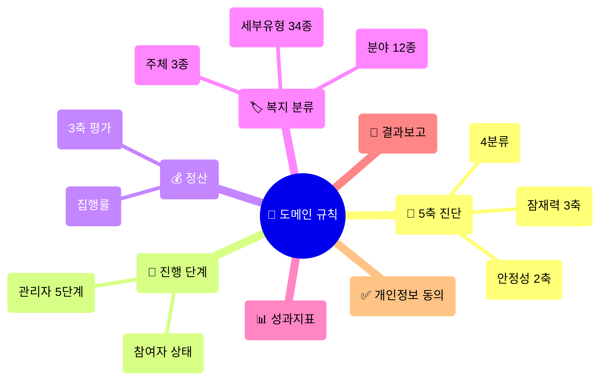

---
tags:
  - reference
  - 도메인규칙
  - 함께일하는재단
source: 사후관리_관리시스템.html
updated: 2026-07-29
---
> [!info] 이 문서의 목적
> 원본 프로토타입 **1,411줄**에서 실무 규칙만 뽑아낸 요약본의 **입구**입니다.
> 규칙을 확인할 때 원본 HTML을 다시 읽지 말고 아래 문서들을 보세요.
> 🔧 구현체: `web/src/lib/domain/` · `web/src/lib/taxonomy.ts`

# 📐 도메인 규칙 — 목차

---

## 규칙 문서

| 문서 | 무엇 | 구현 파일 |
|---|---|---|
| [[규칙 - 5축 진단과 4분류]] | ⭐ 가장 중요. 사후관리 등급 판정 | `domain/classify.ts` |
| [[규칙 - 진행 단계와 참여자 상태]] | 5단계 흐름, 참여자에게 뭐가 보이나 | `domain/stage.ts` |
| [[규칙 - 정산]] | 집행률, 3축 평가, 부실 판정 | `domain/settlement.ts` |
| [[규칙 - 성과지표와 활동이력]] | KPI 달성률, 접촉 기록 | `domain/kpi.ts` |
| [[규칙 - 결과보고와 첨부]] | 승인·반려, 파일 저장 | — |
| [[규칙 - 개인정보 동의]] | 동의 5종, 대상자 추출 | — |
| [[규칙 - 복지 분류 체계]] | 🆕 주체 3종 · 분야 12종 · 세부유형 34종 | `taxonomy.ts` |

---

## 원본 데모 계정

> [!failure] 실서비스로 옮기지 마세요
> 원본 소스에 **평문으로 박혀 있던** 값입니다. 파일을 연 사람은 누구나 관리자로 들어올 수 있었습니다.

| 구분 | 아이디 | 비밀번호 |
|---|---|---|
| 관리자 | `dlawldus` | `dlawldus2026` |
| 참여자 | `hamkke` | `hamkke2026` |

`SYS_ID` / `SYS_PW` 상수는 **참조처 없는 죽은 코드**입니다.

---

## 색 토큰

> [!note] 화면마다 팔레트가 다릅니다
> **참여자 화면**은 재단 실제 사이트(hamkke.org)의 주황 계열,
> **관리자 화면**은 원본 프로토타입의 초록 계열을 씁니다.
> 구현 위치: `web/src/app/globals.css`

### 👤 참여자 (재단 사이트)

| 용도 | 값 |
|---|---|
| 주황 포인트 | `#f5a11e` |
| 눌렀을 때 | `#e08c0c` |
| 옅은 주황 | `#fdf3e3` |
| 검색 패널 배경 | `#f7f3ee` |
| 본문 글자 | `#222222` |
| 설명 글자 | `#767676` |
| 상세검색 버튼 | `#58585a` |

### 🔐 관리자 (원본 프로토타입)

| 용도 | 값 | | 분류 | 글자 | 배경 |
|---|---|---|---|---|---|
| 배경 | `#f6f5f1` | | 🟠 성장연계 | `#993c1d` | `#faece7` |
| 카드 | `#ffffff` | | 🟡 집중관리 | `#854f0b` | `#faeeda` |
| 선 | `#e4e2da` | | 🟢 일반 모니터링 | `#0f6e56` | `#e1f5ee` |
| 글자 | `#2c2c2a` | | ⚪ 관찰·미분류 | `#5f5e5a` | `#f1efe8` |
| 강조 | `#1d7a5f` | | | | |

---

🔗 [[함께일하는재단 통합관리시스템]] · [[함께일하는재단 시스템 - 진행 현황]] · [[함께일하는재단 통합관리시스템 - 재구축 설계 확정서]]
